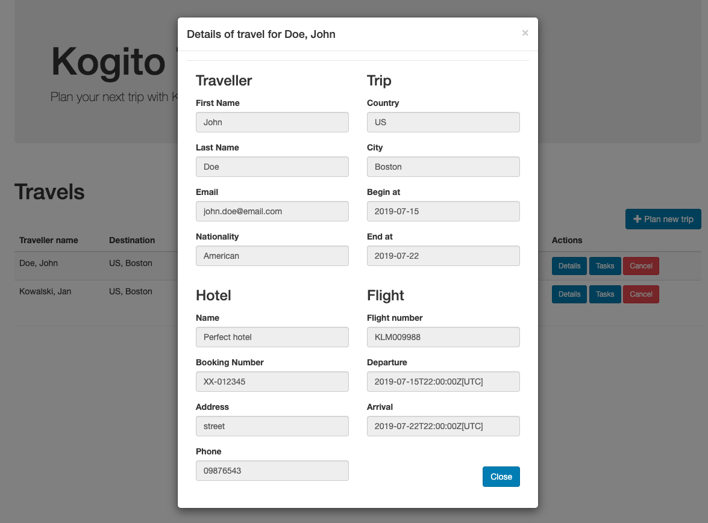
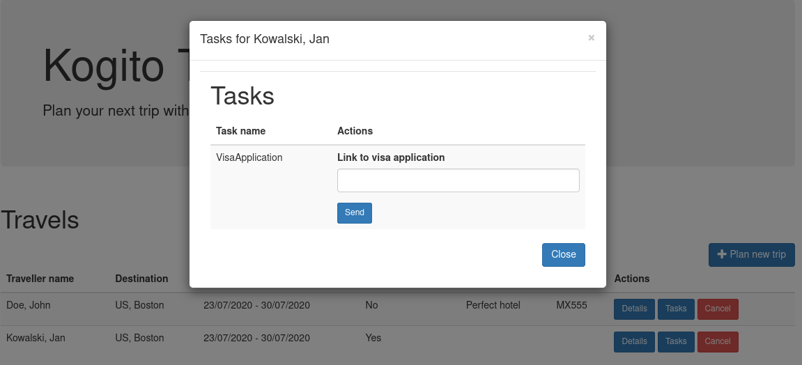

# IBM Travel Agency - base version

## Description

The system calls an RPA bot that checks the desintation in a travel website. If safe, it books hotels and flights. If not safe the travel booking is halted.

## Activities to perform

* Create project using Quarkus Maven plugin with following extensions
  * Kogito
  * OpenApi
* Import project into Eclipse IDE - requires BPMN modeller plugin installed
* Create data model
  * Traveller
  * Hotel
  * Flight
  * Address
  * Trip
* Create service classes 
  * BannedCountryCheck 
  * HotelBookingService
  * FlightBookingService
* Create processes
  * Public business process to deal with complete travel request
  * Private business process to deal with hotel booking
  * Private business process to deal with flight booking
* Create test cases for processes
* Create UI components
* Add metrics support for processes and decisions
* Create dashboard based on metrics

## Data model

IBM Travel Agency booking system will be based on following data model

### Traveller

A person who requests a new travel

### Trip

Place/Location where the traveller wants to go and dates

### Flight

Flight that has been booked for the traveller to take him/her to the destination

### Hotel

Place/Location where the traveller will stay during his/her travel

### Address

Location that is associated with either traveller or hotel

<p align="center"></p>

## RPA Bot

The RPA bot checks the desintation in the travel.state.gov website.    The bot takes as input the desination, and the output is the travel advisory with a status of true meaning it is ok to travel, and false meaning it is not.

<p align="center"></p>

## Business logic

Business logic will be based on business processes

Public process that will be responsible for orchestrating complete travel request

<p align="center"></p>

Private process that will be responsible for booking a hotel.

<p align="center"></p>

Private process that will be responsible for booking a flight.

<p align="center"></p>

## Services

There will be services implemented to carry on the hotel and flight booking. Implementation will be a CDI beans that will have hard coded logic to return a booked flight or hotel.

* org.acme.travels.service.HotelBookingService
* org.acme.travels.service.FlightBookingService

## Try out the complete service

### Installing and Running

#### Prerequisites

You will need:

* Java 11+ installed
* Environment variable JAVA_HOME set accordingly
* Maven 3.5.2+ installed

When using native image compilation, you will also need:

* GraalVM 20 installed
* Environment variable GRAALVM_HOME set accordingly
* Note that GraalVM native image compilation typically requires other packages (glibc-devel, zlib-devel and gcc) to be installed too, please refer to GraalVM installation documentation for more details.

#### Compile and Run in Local Dev Mode

```sh

mvn clean compile quarkus:dev


```

NOTE: With dev mode of Quarkus you can take advantage of hot reload for business assets like processes, rules and decision
tables and java code. No need to redeploy or restart your running application.

#### Compile and Run using Local Native Image

Note that this requires GRAALVM_HOME to point to a valid GraalVM installation

```sh
mvn clean package -Pnative
```

To run the generated native executable, generated in `target/`, execute

```sh
./target/kogito-travel-agency-{version}-runner
```


## User interface

IBM Travel Agency comes with basic UI that allows to

### Plan new trips

<p align="center"></p>

### List currently opened travel requests

<p align="center"></p>

### Show details of selected travel request

<p align="center"></p>

### Show active tasks of selected travel request

<p align="center"></p>

### Cancel selected travel request

To start IBM Travel Agency UI just point your browser to [http://localhost:8081](http://localhost:8081)

## REST API

Access the generated API here:

http://localhost:8081/q/swagger-ui/

business central:

http://localhost:8081/business-central/kie-wb.jsp


Once the service is up and running, you can use the following examples to interact with the service.

### POST /travels

Send travel that does not require visa

```sh
curl -H "Content-Type: application/json" -H "Accept: application/json" -X POST http://localhost:8081/travels -d @- << EOF
{
  "traveller" : {
    "firstName" : "John",
    "lastName" : "Doe",
    "email" : "john.doe@example.com",
    "nationality" : "American",
    "address" : {
      "street" : "main street",
      "city" : "Boston",
      "zipCode" : "10005",
      "country" : "US"
    }
  },
  "trip" : {
    "city" : "New York",
    "country" : "US",
    "begin" : "2019-12-10T00:00:00.000+02:00",
    "end" : "2019-12-15T00:00:00.000+02:00"
  }
}
EOF

```

This will directly go to 'ConfirmTravel' user task.

Send travel request that requires does require visa

```sh
curl -H "Content-Type: application/json" -H "Accept: application/json" -X POST http://localhost:8081/travels -d @- << EOF
{
  "traveller" : {
    "firstName" : "Jan",
    "lastName" : "Kowalski",
    "email" : "jan.kowalski@example.com",
    "nationality" : "Polish",
    "address" : {
      "street" : "polna",
      "city" : "Krakow",
      "zipCode" : "32000",
      "country" : "Poland"
    }
  },
  "trip" : {
    "city" : "New York",
    "country" : "US",
    "begin" : "2019-12-10T00:00:00.000+02:00",
    "end" : "2019-12-15T00:00:00.000+02:00"
  }
}
EOF
```

This will stop at 'VisaApplication' user task.

### GET /travels

Returns list of travel requests currently active:

```sh
curl -X GET http://localhost:8081/travels
```

As response an array of travels is returned.

### GET /travels/{id}

Returns travel request with given id (if active):

```sh
curl -X GET http://localhost:8081/travels/{uuid}
```

As response a single travel request is returned if found, otherwise 404 Not Found is returned.

### DELETE /travels/{id}

Cancels travel request with given id

```sh
curl -X DELETE http://localhost:8081/travels/{uuid}
```

### GET /travels/{id}/tasks

Returns currently assigned user tasks for give travel request:

```sh
curl -X GET http://localhost:8081/travels/{uuid}/tasks
```

### GET /travels/{id}/VisaApplication/{taskId}

Returns visa application task information:

```sh
curl -X GET http://localhost:8081/travels/{uuid}/VisaApplication/{task-uuid}
```

### POST /travels/{id}/VisaApplication/{taskId}

Complete visa application task by sending a valid URL to the VISA document stored in any cloud provider:

```sh
curl -H "Content-Type: application/json" -H "Accept: application/json" -X POST http://localhost:8081/travels/{uuid}/VisaApplication/{task-uuid} -d '{"visaApplication": "https://mydrive.example.com/JanVisaApplicationForm.pdf"}'
```

### GET /travels/{id}/ConfirmTravel/{taskId}

Returns travel (hotel, flight) task information required for confirmation:

```sh
curl -X GET http://localhost:8081/travels/{uuid}/ConfirmTravel/{task-uuid}
```

### POST /travels/{id}/ConfirmTravel/{taskId}

Completes confirms travel task - meaning confirms (and completes) the travel request

```sh
curl -H "Content-Type: application/json" -H "Accept: application/json" -X POST http://localhost:8081/travels/{uuid}/ConfirmTravel/{task-uuid} -d '{}'
```

## Known issues
